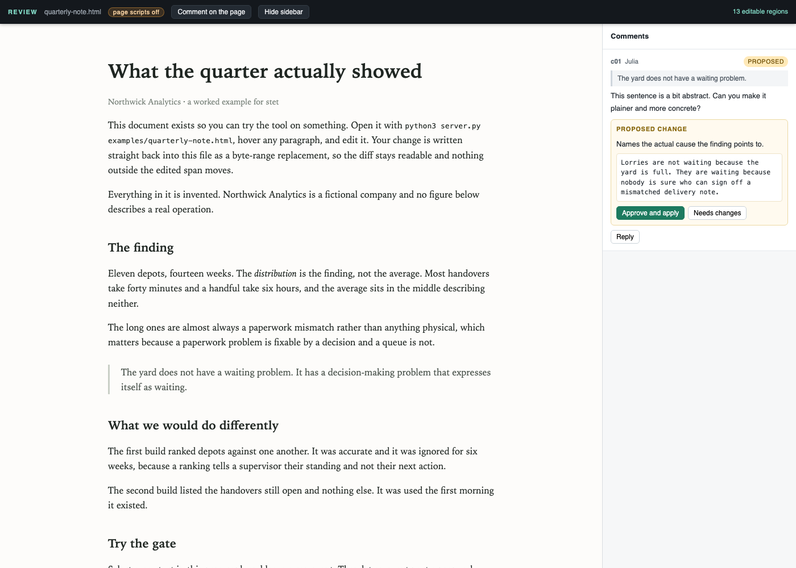

# stet

**Fix the words in an HTML document yourself. Your AI agent proposes its changes, and they reach the file only when you approve them.**



*A comment on the right, the agent's proposed rewrite under it, and nothing changes in the file
until you press **Approve and apply**.*

---

## Who it is for

You work with an AI coding agent, such as Claude Code or Codex, and it writes you HTML
documents: a report, a one-pager, a mock, a brief. They look good and they are nearly right.

You want to change a few sentences, and you want the agent to help with the rest without
quietly rewriting paragraphs you were happy with.

## The problem

When a document is nearly right, your options are usually poor:

- **Ask the agent to regenerate it**, then re-read the whole thing to find what else moved
- **Open the markup and edit it by hand**, hunting for your sentence between the tags
- **Copy the text somewhere else**, fix it, and paste it back into a copy that has lost the design

And whichever you pick, nothing asks the agent to wait for your yes before it changes your words.

## What stet gives you

- **You type straight into the document.** It opens in your browser looking exactly as it was
  built. Click a block (a paragraph, heading, list item or table cell), retype it and press
  Save, and that block is written back into the real file.
- **Only your sentence changes.** The rest of the file stays byte for byte as it was, so nothing
  is reformatted and a git diff shows exactly what you changed.
- **The agent proposes, you decide.** When the agent answers a comment, its rewrite appears as
  a proposal beside the text, and you approve it or send it back. Until you approve, the file
  does not change.
- **A record of who changed what.** Every edit, yours and the agent's, is logged with before,
  after and author in a `.review/` folder beside the document.

---

## Quick start

You need Python 3 (tested on 3.13). stet itself has no other dependencies.

```bash
git clone https://github.com/jasducky/stet.git
cd stet
python3 server.py examples/quarterly-note.html
```

Open the address it prints (`http://localhost:8790/` by default).

1. Click any paragraph, change a word and press Save. Run `git diff` in the `stet` folder:
   only that paragraph changed.
2. Select some text and leave a comment.
3. To have your agent answer it, set up the agent as described in the next section.

To use it on your own document, point it at that file instead, and add `.review/` to that
project's `.gitignore`:

```bash
python3 server.py ~/path/to/report.html
```

---

## Using it with your AI agent

stet works with any agent that can run commands on your computer. It is built for
**Claude Code** and **Codex**. There is no plugin to install: the agent talks to stet through
one small command, `watch.py`, which waits until you do something and then tells the agent what.

**In everyday use**, you say something like:

> *"Open report.html in stet and answer my comments with proposals."*

**To teach your agent once**, paste this into your project's `CLAUDE.md` (Claude Code) or
`AGENTS.md` (Codex):

```markdown
## Reviewing HTML documents with stet

stet lives at ~/stet. To open a document for review, start the server in the background:
  python3 ~/stet/server.py <file.html> --detach
Then wait for my comments, using your own name (for example "claude" or "codex"):
  python3 ~/stet/watch.py <file.html> --as <agent name> --since 0
watch.py prints each new event as a JSON line. A comment event carries its "id" and the
"unit" (the id of the block it is on). It also prints one line like {"cursor": "3"} (on
stderr): pass that number as --since next time. If nothing happens for 5 minutes it returns empty, so run it again.
Answer a comment by proposing a rewrite, never by editing the file:
  POST http://localhost:8790/__propose
  {"id": "<comment id>", "unit": "<unit>", "text": "<new text>", "note": "<why>", "author": "<agent name>"}
Then run watch.py again with the new cursor.
```

Change `~/stet` to wherever you cloned it, and the port if you started the server with `--port`.

**What the agent does on each turn:**

1. runs `watch.py`, which returns as soon as you comment or edit
2. reads your comment, and the whole thread in `.review/<document name>/comments.json` if it
   needs it
3. sends a proposal to `/__propose`
4. runs `watch.py` again

Proposing is the only change an agent can make through stet. Editing, approving and rejecting
are reserved for you, in the page.

The server stops by itself after 15 minutes in which you have not touched the page. Start it
again and everything is still there: comments, proposals and the record of edits live in
`.review/`, not in the server.

---

## How it compares

| | Works on your own HTML file | You type into the text | The agent's changes wait for your yes |
|---|---|---|---|
| [Plannotator](https://github.com/backnotprop/plannotator) | Comments only on HTML | On Markdown | One approval for the whole document |
| [claude-review](https://github.com/Ch00k/claude-review) | No, Markdown only | No, you comment and the agent edits | No |
| [Artifact Server](https://github.com/plannotator/artifact-server) | Yes | Yes | No agent involved |
| [Claude Docs](https://support.claude.com/en/articles/16923645-get-started-with-claude-docs) | No, a document inside Claude | Yes | No, the agent's edits land straight away |
| [Revise](https://revise.io) | No, its own editor | Yes | Yes, as suggested edits |
| **stet** | **Yes** | **Yes** | **Yes, one change at a time** |

If you want threaded comments on Markdown and do not need editing or approval, claude-review is
the mature choice.

---

## Limits

- **The approval step relies on the agent using stet.** An agent that can write files can still
  open your HTML and change it directly, and no tool running on your machine can stop that.
  stet notices when the file changes underneath it and refuses to write over the change.
- **Text built by the page's own JavaScript can be commented on, not edited.** That text is not
  in the file, so an edit to it could not be saved. stet marks those blocks as comment-only
  rather than accept an edit it would lose.
- **HTML only**, one document per server, on your own machine. It listens on `127.0.0.1` and
  nothing else.

---

## More

- **Options:** `python3 server.py <file.html> [--port 8790] [--author NAME] [--detach] [--idle-timeout 900]`.
  `--detach` keeps the server running after the command that started it ends, which is what an
  agent needs.
- **How it works, and the tests:** [docs/how-it-works.md](docs/how-it-works.md)
- **Exact behaviour:** [SPEC.md](SPEC.md)
- **The name:** *stet* is the proofreader's mark meaning *let it stand*, the note an editor writes
  to say *leave my words as they are*.

## Credit

The server lifecycle design (parent-death watchdog, idle timeout, `/info` for port reuse) is
taken from [paraschopra/make-pages-interactive](https://github.com/paraschopra/make-pages-interactive).

## Licence

MIT.
